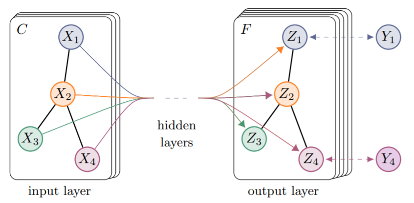
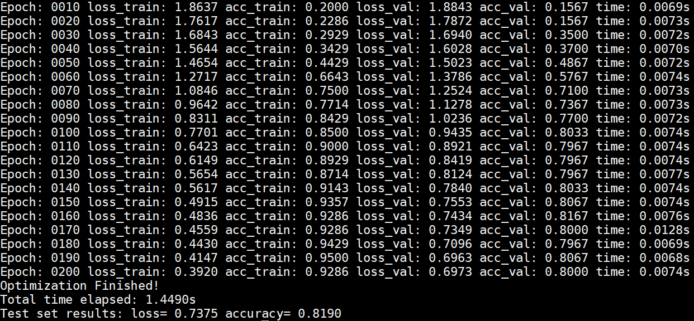

# Stat992 
## This blog brief introduces the technique of GCN.

# Introduction
This paper considers the problem of classifying nodes in a graph where only a small part of nodes have labels. The GCN introduced in this paper belongs to the family of spectral graph convolutional networks.

# Overview of this technique

On this figure,  is the original features of nodes (Some nodes have labels and some nodes don't have labels).  is the final prediction of nodes and  is the ground-truth label for nodes (Not all nodes have labels).  is the channel number of input layer and  is the channel number of output layer.

# Math Formula

 is the matrix of node features vectors,  is the adjacency matrix and  is the degree metrix.

Let  which is the adjacency matrix with added self-connection. The paper uses the first order approximation of spectral decomposition to get a simple form of graph model (Please refer to the original paper for the detailed math derivation https://arxiv.org/pdf/1609.02907.pdf):

They calculate  and the forward model for calculating the representation of nodes is 
={\rm%20softmax}(\hat{A}{\rm%20ReLU}%20(\hat{A}XW^{(0)})W^{(1)})%20), 
where }) is the input-to-hidden weight matrix and }) is the hidden-to-output weight matrix and they are trained using gradient descent.

The loss is computed from cross-entropy from the labeled nodes in the graph:
)

# One example:

### Dataset

|          Dataset        | Type  | Nodes  |  Edges | Classes | Features |  Label Rate|
| ---------------------- | ------------ | ------------ | ------------ | ------------ | ------------ | ------------ |
| Cora        | Citation Network | 2708 |  5429 | 7 | 1433 | 0.052  |

The citation links are the undirected edges and the sparse bag-of-words feature vectors of each document are the nodes.

### Experiments

The training log is shown here:

It could achieve a high accuracy with high speed.

# References

https://arxiv.org/pdf/1609.02907.pdf

https://github.com/tkipf/pygcn

